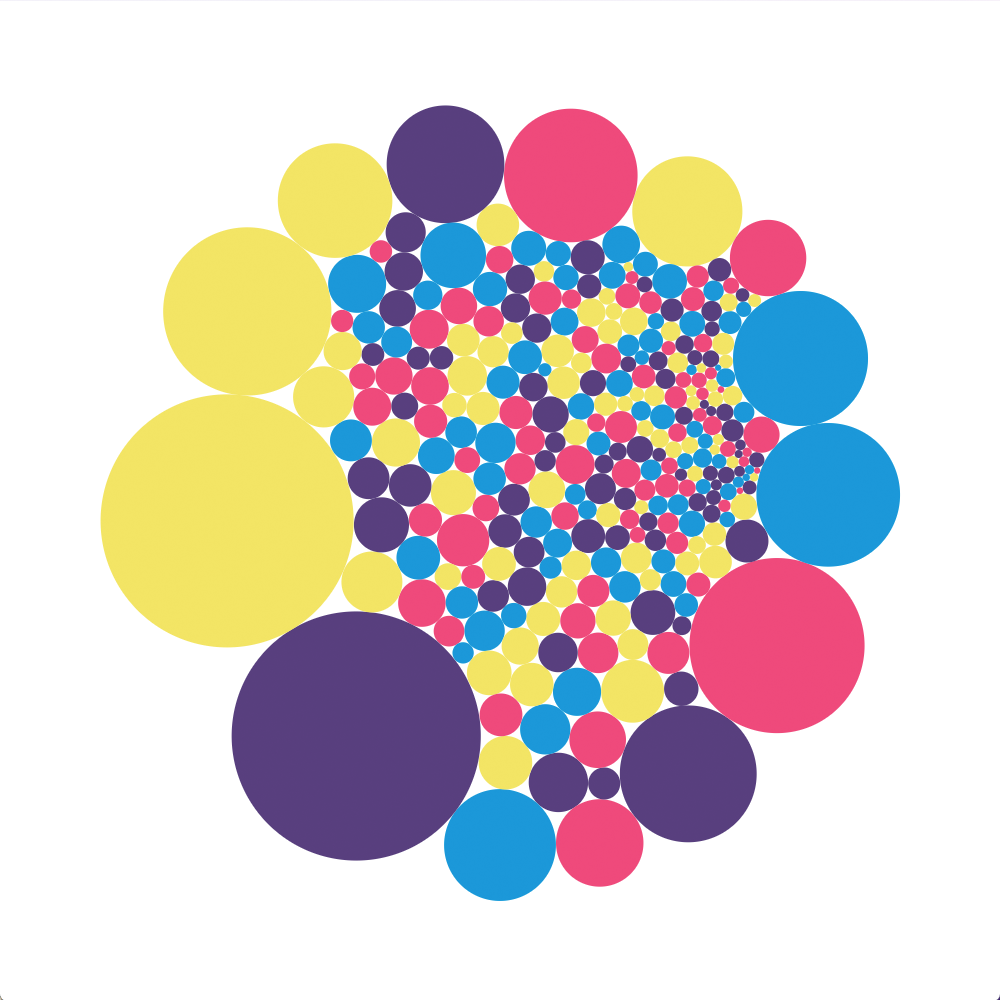
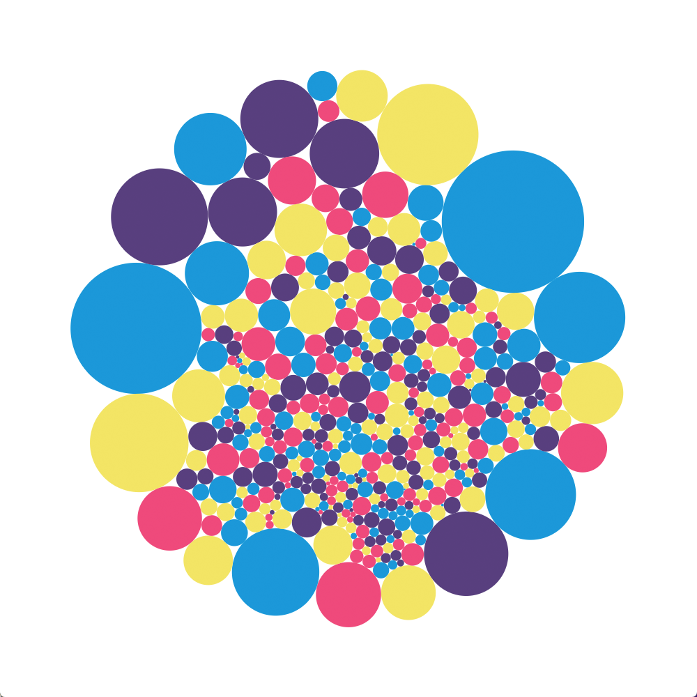

# CircuPack

**Define tangencies. Get precise circle packings.**

A robust Java library that computes Euclidean circle packings from triangulations. Ported from Gerald Orick’s [GOPack](https://github.com/kensmath/GOPack) for accuracy and reliability.

<p align="center">
    
    
    
</p>

## Core Idea

Supply a `Triangulation` that defines *which circles are tangent to which*. CircuPack handles all the geometry: it calculates exact radii and center positions so every specified tangency is visually perfect.


## Key Features

*   **Simple Input:** Implement the `Triangulation` interface to define your graph of tangencies.
*   **Automatic Geometry:** No need to guess positions or sizes. The engine computes everything.
*   **Multiple Layouts:** Pack into a disc (MAX_PACK), a custom polygon, or a rectangle.
*   **Production-Ready:** Built-in numerical safeguards for stable, reliable results.


## Quick Start

```java
// 1. Define your triangulation (e.g., from Tinfour)
IIncrementalTin tin = new IncrementalTin();
// ... add vertices ...
Triangulation tri = new TinfourTriangulation(tin);

// 2. Initialize the packer
CircuPacker packer = new CircuPacker(tri);
packer.initialize();

// 3. Compute the packing
packer.riffle(10); // Iterate upto 10 times for high precision

// 4. Retrieve results
double[] radii = packer.getRadii();
double[] centersX = packer.getCentersX();
double[] centersY = packer.getCentersY();
```
