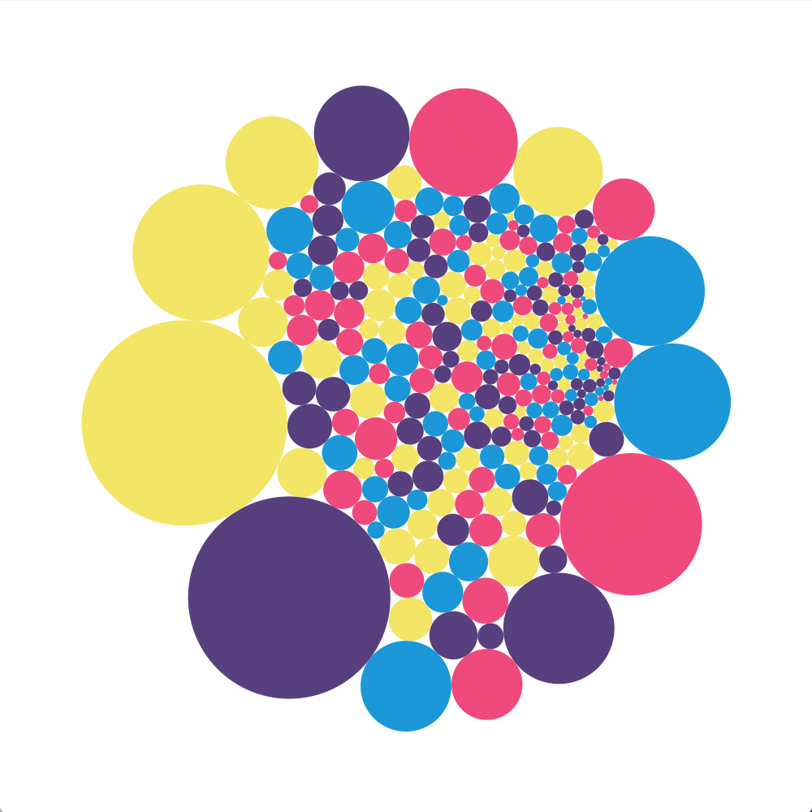
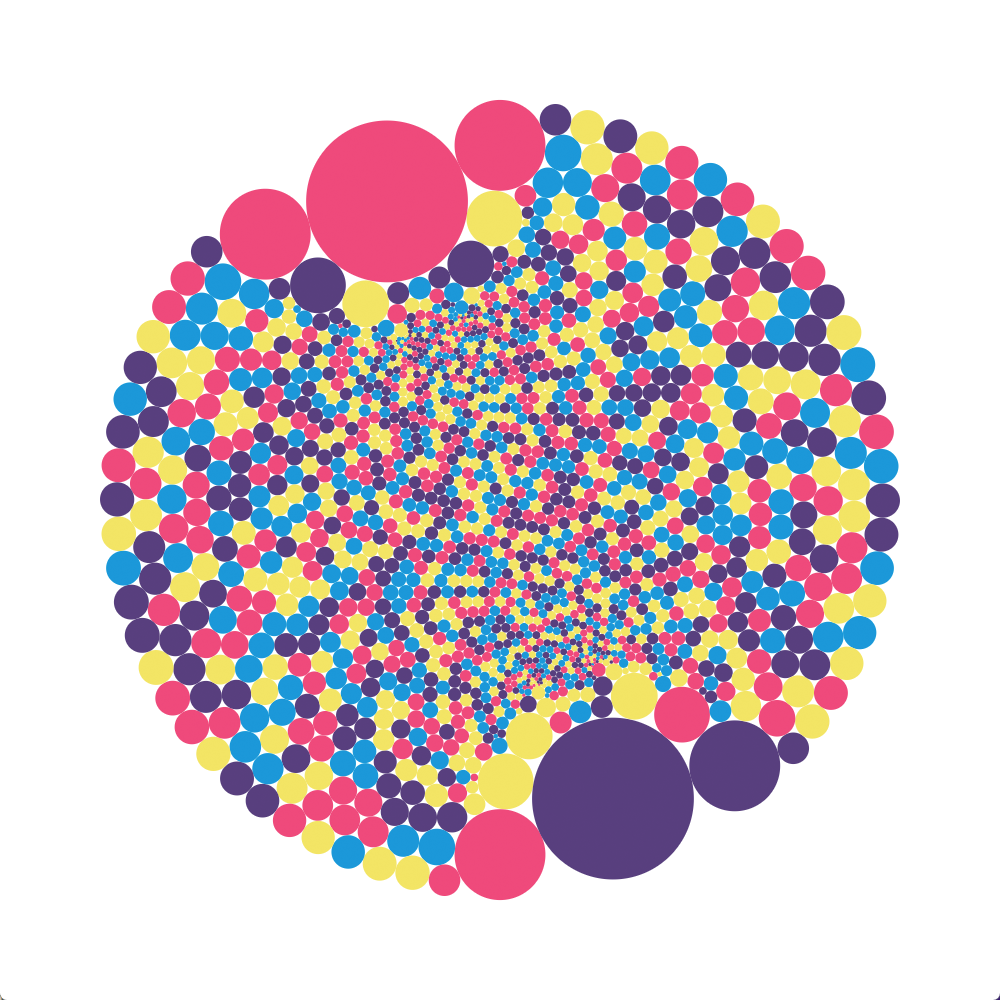
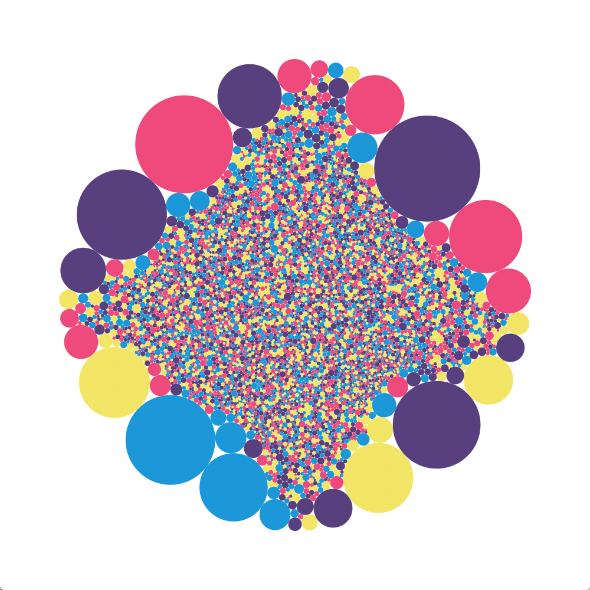

[](https://jitpack.io/#micycle1/CircuPack)
# CircuPack

**Define tangencies. Get precise circle packings.**

A robust Java library that computes Euclidean circle packings from triangulations. Inspired by Gerald Orick’s [GOPack](https://github.com/kensmath/GOPack).

<p align="center">
    
    
    
</p>

## Core Idea

Supply a `Triangulation` that defines *which circles are tangent to which*. CircuPack handles all the geometry: it calculates exact radii and center positions so every specified tangency is visually perfect.


## Key Features

*   **Simple Input:** Implement the `Triangulation` interface to define your graph of tangencies — pure combinatorics, no geometry needed.
*   **Automatic Geometry:** No need to guess positions or sizes. The engine computes everything.
*   **Multiple Layouts:** Pack into a disc (max packing), a rectangle, or a polygon with prescribed corner angles.
*   **Production-Ready:** Stable, reliable and fast (10k circles in ~1s).


## Quick Start

```java
// 1. Define your triangulation (e.g., from Tinfour)
IIncrementalTin tin = new IncrementalTin();
// ... add vertices ...
Triangulation tri = new TinfourTriangulation(tin);

// 2. Create the packer (defaults to max packing in the unit disc)
CircuPacker packer = new CircuPacker(tri);

// 3. Compute the packing
double maxError = 0.01; // max visual error (overlap, as a fraction of circle radius)
packer.riffle(maxError); // Iterate until max error is below threshold

// 4. Retrieve results
double[] radii = packer.getRadii();
double[] centersX = packer.getCentersX();
double[] centersY = packer.getCentersY();
```

## Polygon & Rectangle Packing

Instead of a disc, the boundary can be packed into an n-gon: pick boundary
vertices as corners and (optionally) prescribe the interior angle at each. Side
lengths emerge from the packing itself.

```java
CircuPacker packer = new CircuPacker(tri);

// rectangle: 4 corners with right angles, chosen evenly along the boundary...
packer.setRectanglePack();
// ...or supply your own corner vertices
// packer.setRectanglePack(new int[] { c0, c1, c2, c3 });

// general polygon: n evenly spaced corners with equal angles...
// packer.setPolygonPack(5);
// ...or explicit corners and angles (angles sum to (n-2)*pi)
// packer.setPolygonPack(corners, angles);

packer.riffle(0.01);

int[] corners = packer.getCorners(); // CCW corner vertices actually used
double aspect = packer.getAspect();  // rectangle aspect ratio (4-corner packings)
```
